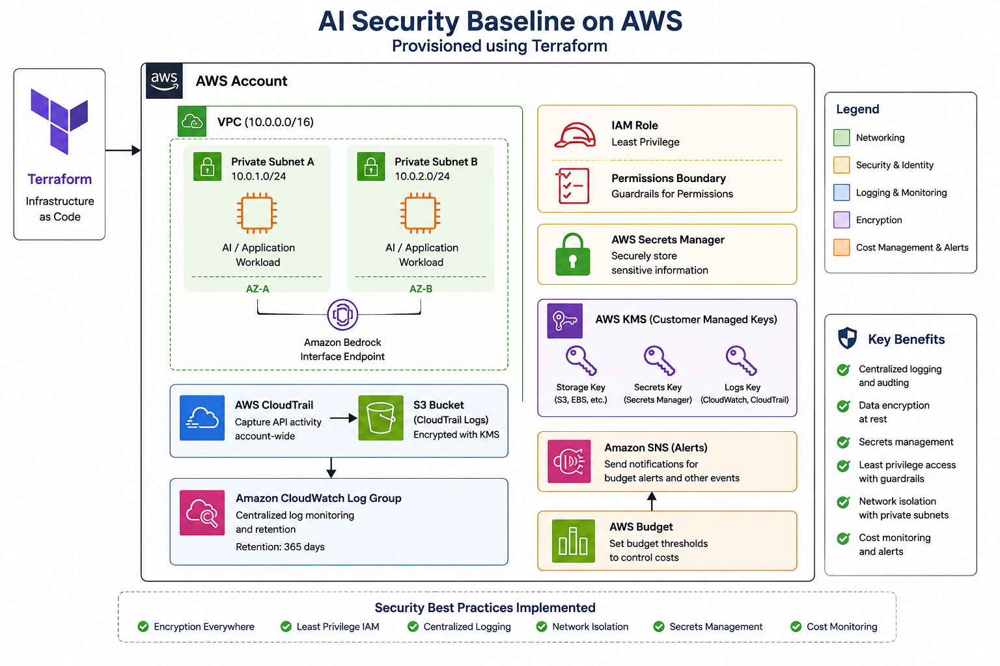

# AI Security Baseline on AWS using Terraform

## Architecture 



## Overview

This project implements a secure AWS infrastructure baseline using Terraform. It demonstrates cloud security best practices including encryption, centralized logging, secrets management, identity controls, network isolation, and cost monitoring.

The project was developed to strengthen practical AWS cloud security and Infrastructure as Code (IaC) skills.

---

## Features

- Secure VPC with private subnets
- AWS CloudTrail for audit logging
- AWS KMS encryption for logs, storage, and secrets
- AWS Secrets Manager
- CloudWatch Log Group
- IAM Role with Permissions Boundary
- Account-level EBS encryption
- S3 Public Access Block
- Cost Budget Alerts
- SNS Alert Notifications
- Bedrock Private VPC Endpoint
- Restricted Security Group egress

---

## Technologies

- Terraform
- AWS IAM
- Amazon VPC
- AWS KMS
- AWS CloudTrail
- Amazon CloudWatch
- AWS Secrets Manager
- Amazon SNS
- AWS Budgets

---

## Project Structure

```
.
├── main.tf
├── variables.tf
├── terraform.tfvars.example
├── modules/
│   ├── account/
│   ├── budgets/
│   ├── cloudtrail/
│   ├── iam/
│   ├── kms/
│   ├── logs/
│   ├── secrets/
│   └── vpc/
├── evidence/
└── README.md
```

---

## Security Controls

✔ CloudTrail enabled

✔ Customer-managed KMS encryption

✔ Secrets stored in AWS Secrets Manager

✔ CloudWatch log retention

✔ Private networking

✔ Least-privilege IAM design

✔ Budget monitoring

✔ Account-wide EBS encryption

✔ S3 Public Access Block

---

## Deployment

```bash
terraform init

terraform plan -var-file=terraform.tfvars

terraform apply
```

---

## Future Improvements

- AWS Config Rules
- GuardDuty
- Security Hub
- AWS WAF
- AWS Inspector
- CI/CD with GitHub Actions
- tfsec / Checkov integration

---

## Skills Demonstrated

- Infrastructure as Code
- AWS Cloud Security
- IAM Hardening
- KMS Key Management
- Logging & Monitoring
- Secrets Management
- Network Security
- Cost Governance

---

## Author

Krishna Tambare

Cybersecurity Student | AWS Cloud Security | Terraform